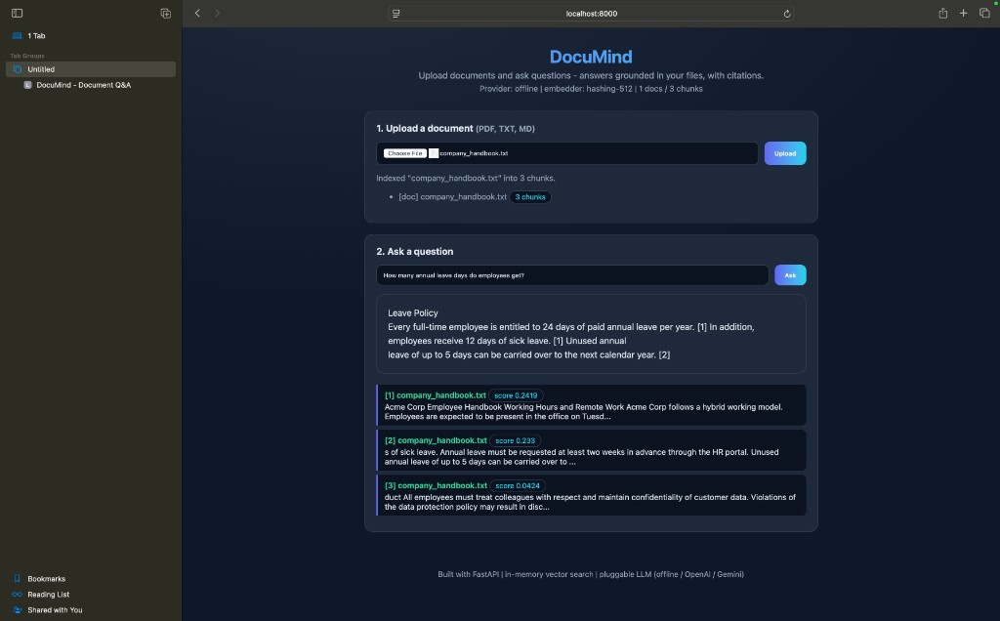
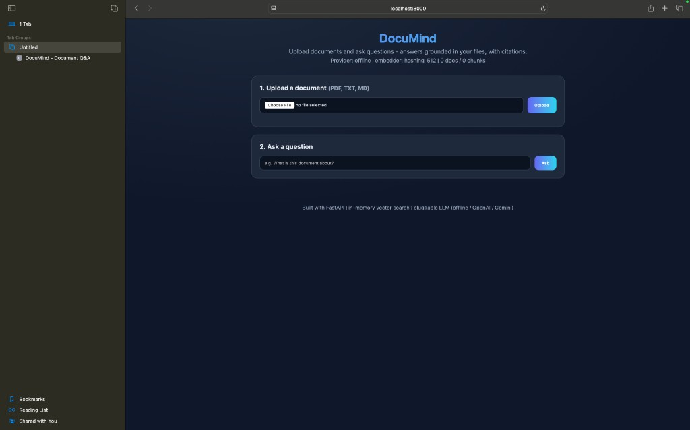
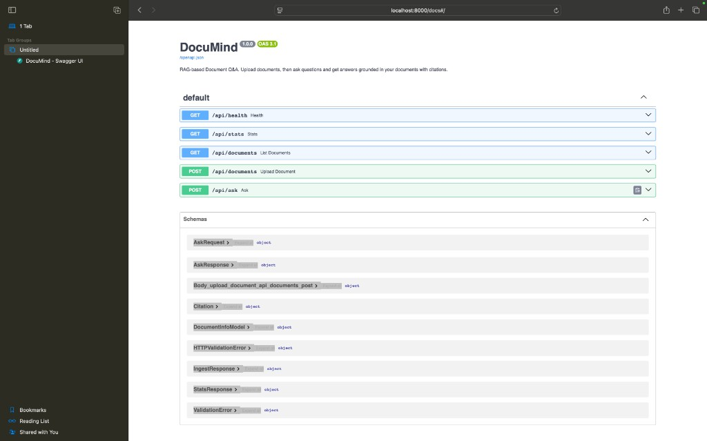

<div align="center">

# DocuMind

### Chat with your documents - a Retrieval-Augmented Generation (RAG) engine built from scratch

[](https://github.com/BhumikaMahajan87/documind/actions/workflows/ci.yml)


Upload a PDF or text document, ask questions in plain English, and get answers
**grounded in your own documents - with source citations.**

</div>

---

## What is DocuMind?

DocuMind is a question-answering system for your documents. Instead of reading a
50-page report to find one fact, you upload it and simply ask:
*"What is the refund policy?"* - and DocuMind replies with the exact answer plus
a citation pointing to where it came from.

It is powered by **Retrieval-Augmented Generation (RAG)**, the same technique
behind modern AI assistants like ChatGPT's document mode. The entire pipeline
(text extraction, chunking, embeddings, vector search, and answer generation) is
implemented from scratch to demonstrate how production AI systems actually work.

> **Runs 100% offline with zero API keys.** Optionally plug in your own free
> OpenAI or Google Gemini key for higher-quality answers - the system
> auto-detects it. No paid or third-party keys required to try it.

## Demo

Ask a question and get an answer grounded in the uploaded document, with ranked
source citations:



The clean upload-and-ask interface:



Auto-generated, interactive API documentation (Swagger UI at `/docs`):



## Key Features

- **End-to-end RAG pipeline** - ingestion -> chunking -> embeddings -> vector
  search -> grounded answer generation.
- **Answers with citations** - every answer links back to the source chunks, so
  responses are trustworthy and verifiable (no hallucinated facts).
- **Pluggable AI backends** - three embedding backends (OpenAI / local
  Sentence-Transformers / a dependency-free hashing embedder) and three answer
  generators (OpenAI / Gemini / an offline extractive engine), selected
  automatically based on configuration.
- **Zero-config & offline-first** - works out of the box with no API key, no
  external database, and no internet.
- **Clean, documented web UI** plus a fully documented REST API.
- **Production hygiene** - typed configuration, a 16-test suite, Docker support,
  and CI running on Python 3.11 and 3.12.

## Tech Stack

| Layer            | Technology                                                        |
| ---------------- | ----------------------------------------------------------------- |
| API & Web        | FastAPI, Uvicorn, Pydantic v2                                     |
| AI / Retrieval   | RAG, embeddings, cosine-similarity vector search                  |
| Embeddings       | OpenAI · Sentence-Transformers · custom hashing-trick embedder    |
| Generation       | OpenAI · Google Gemini · offline extractive answerer              |
| Document parsing | pypdf, custom sentence-aware chunker                              |
| Tooling          | Pytest, Docker, GitHub Actions (CI), NumPy                       |

## How It Works

```
  Upload (PDF/TXT)
        |
        v
  [ Ingestion ] -> [ Chunking ] -> [ Embedder (OpenAI / local / hashing) ]
                                              |
                                              v
                                   [ Vector Store (cosine search) ]
                                              ^
  Question -> embed --- top-k retrieval ------+
                                   |
                                   v
                        [ LLM (offline / OpenAI / Gemini) ]
                                   |
                                   v
                        Answer + citations
```

Each stage is an interface with multiple implementations, swapped automatically
based on what is installed or configured.

## Project Highlights

| Metric                        | Value                                            |
| ----------------------------- | ------------------------------------------------ |
| Automated tests               | 16 (unit + end-to-end API), green on CI          |
| Python versions tested        | 3.11 and 3.12                                    |
| Embedding backends            | 3 (interchangeable)                              |
| Answer-generation backends    | 3 (interchangeable)                              |
| External services required    | 0 - runs fully offline                           |
| Supported file types          | PDF, TXT, Markdown                               |

## Getting Started

```bash
# 1. Install dependencies (works offline, no API key needed)
pip install -r requirements.txt

# 2. Run the server
uvicorn app.main:app --reload

# 3. Open in your browser
#    Web UI:           http://localhost:8000
#    Interactive API:  http://localhost:8000/docs
```

Upload `sample_docs/company_handbook.txt`, then ask:
*"How many days of annual leave do employees get?"*

### Run with Docker

```bash
docker compose up --build
```

### Optional: use a personal LLM key

Copy `.env.example` to `.env` and add your own free/personal key:

```env
OPENAI_API_KEY=sk-...      # or
GEMINI_API_KEY=...
```

The provider is auto-detected - no code changes needed.

## API Reference

| Method | Endpoint          | Description                              |
| ------ | ----------------- | ---------------------------------------- |
| POST   | `/api/documents`  | Upload & index a document (multipart)    |
| GET    | `/api/documents`  | List indexed documents                   |
| POST   | `/api/ask`        | Ask a question, get answer + citations   |
| GET    | `/api/stats`      | Index stats & active provider            |
| GET    | `/api/health`     | Health check                             |

```bash
curl -F "file=@sample_docs/company_handbook.txt" http://localhost:8000/api/documents

curl -X POST http://localhost:8000/api/ask \
  -H "Content-Type: application/json" \
  -d '{"question": "What is the reimbursement policy?"}'
```

## Engineering Decisions

- **Why an in-memory vector store?** It keeps the project zero-config while
  demonstrating the exact mechanics of a vector database (store embeddings,
  retrieve nearest neighbours by cosine similarity). The `VectorStore` interface
  can be swapped for FAISS, pgvector, or Pinecone without touching the rest of
  the code.
- **Why a hashing embedder fallback?** So the project always runs - even with no
  API key and no heavy ML dependencies. It uses the hashing trick with TF
  weighting and L2 normalisation to produce deterministic, comparable vectors.
- **Why citations?** Grounding every answer in retrieved source chunks is what
  separates a trustworthy RAG system from a model that simply makes things up.

## Testing

```bash
pytest -q
```

CI runs the full suite on Python 3.11 and 3.12 on every push.

## Roadmap

- [ ] Swap the in-memory store for FAISS / pgvector
- [ ] Persistent, multi-user document collections
- [ ] Streaming responses and conversation memory
- [ ] Cross-encoder re-ranking of retrieved chunks

## Author

**Bhumika Mahajan**
[GitHub](https://github.com/BhumikaMahajan87) · [LinkedIn](https://www.linkedin.com/in/bhumika-mahajan-90ba90388/)

## License

Released under the MIT License.
